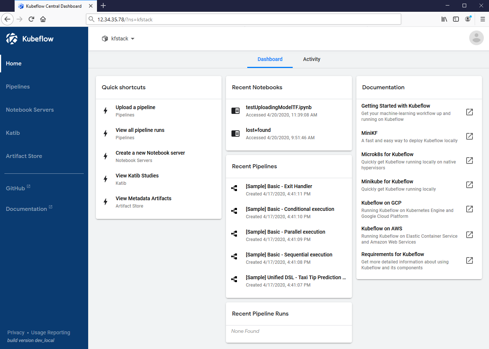

# Setup Kubeflow on Azure Stack Hub Kubernetes Cluster

In this article, you will:

1. deploy a linux virtual machine with Azure Stack Hub marketplace and install AKS engine on it.
2. deploy a Azure Stack Hub Kubernetes cluster with AKS engine
3. deploy Kubeflow on the Kubernetes cluster

## Prerequisites

Make sure you have access to Azure Stack Hub.

## Set up a virtual machine with AKS engine installed

Create a linux virtual machine with Azure Stack Hub, and install AKS engine on the VM by following [this guide](https://docs.microsoft.com/en-us/azure-stack/user/azure-stack-kubernetes-aks-engine-deploy-linux?view=azs-2008)

## Deploy Kubernetes Cluster on the Azure Stack Hub with AKS engine installed on the VM

Follow [this instruction](https://docs.microsoft.com/en-us/azure-stack/user/azure-stack-kubernetes-aks-engine-deploy-cluster?view=azs-2008), before you deploy a Kubernetes cluster, you need to download
the API model json file and modifying it according to your needs.

One important update to the API model json file is to [enable service account token volume projection](https://docs.microsoft.com/en-us/azure-stack/user/kubernetes-aks-engine-service-account?view=azs-2008).
You can see a complete sample API model json file [here](k8_ash.json)

## Deploy Kubeflow on the Kubernetes cluster

From a machine with access to your Azure Stack Hub instance, you can connect via SSH into the new master node using a client such as PuTTY.
Then follow [this guide](https://www.kubeflow.org/docs/started/k8s/kfctl-k8s-istio/) to install Kubeflow.

## Opening Kubeflow dashboard

To access the dashboard using external connection, replace "type: NodePort" with "type: LoadBalancer" using the patch command:

    $ kubectl patch svc/istio-ingressgateway -p '{"spec":{"type": "LoadBalancer"}}' -n istio-system
    service/istio-ingressgateway patched

Alternatively, you can edit istio-ingressgateway directly like so:

    $ kubectl edit -n istio-system svc/istio-ingressgateway
    service/istio-ingressgateway edited

Then the EXTERNAL-IP will become available from:

    $ kubectl get -w -n istio-system svc/istio-ingressgateway
    NAME                   TYPE           CLUSTER-IP     EXTERNAL-IP   PORT(S)                          AGE
    istio-ingressgateway   LoadBalancer   10.0.123.210   12.34.56.78   15020:30397/TCP,80:31380/TCP,..  7m27s

When you have your istio-ingressgateway's external ip,
open it in your browser with http://external_ip, and make sure your firewall rules allow HTTP port 80.

